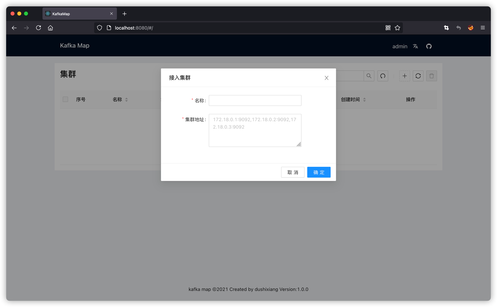
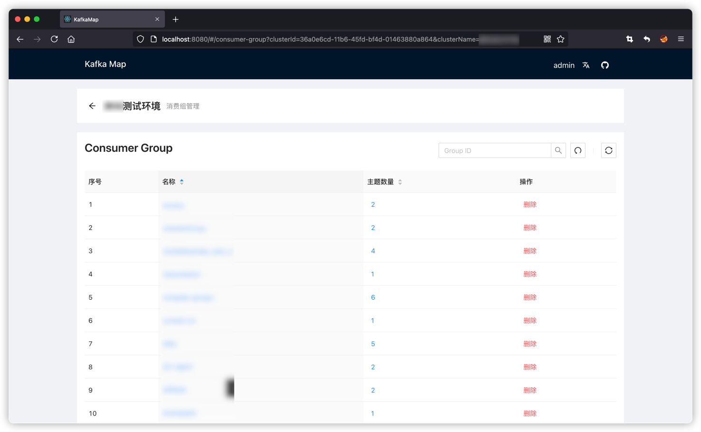
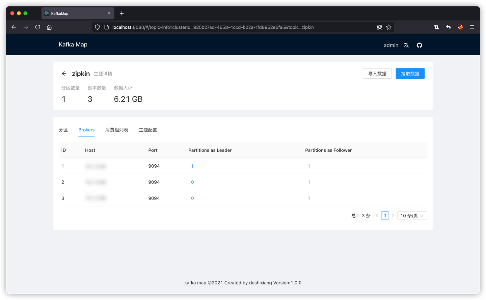
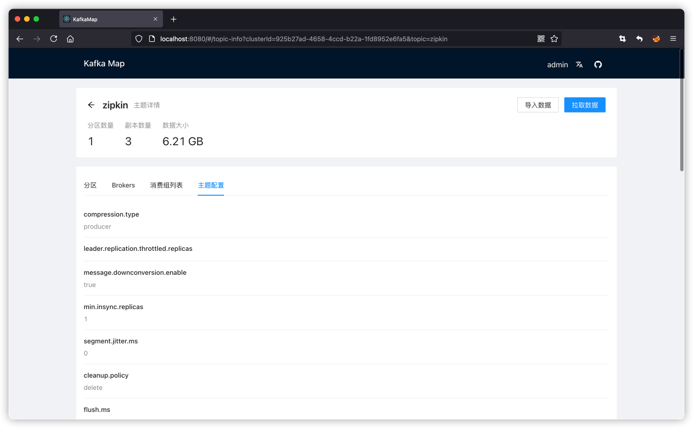
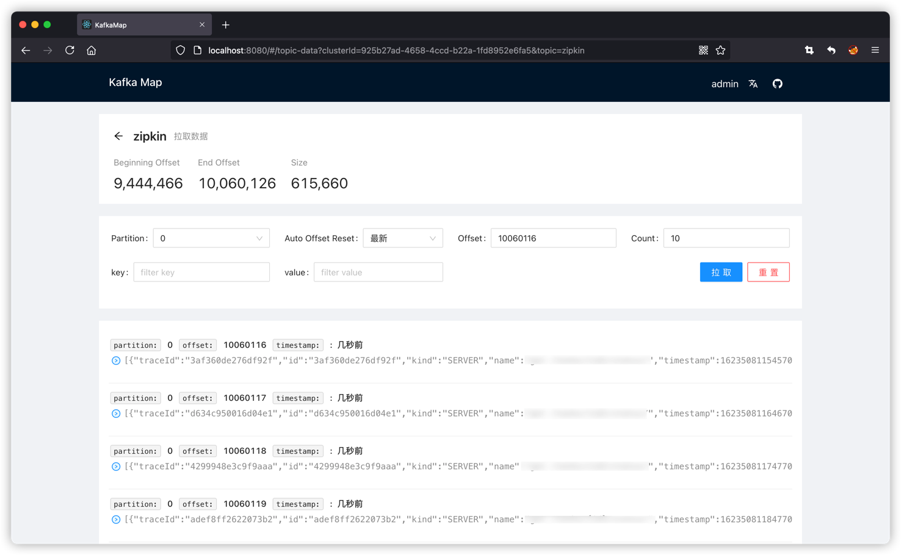

# kafka map

English | [简体中文](./README-zh_CN.md)

Add wings to programming and install navigation to `kafka`。

## Introduction

`kafka-map` is a `kafka` visualization tool developed using `Java11` and `React`.

Supported features:

- Multi-cluster management.
- Cluster status monitoring (number of partitions, number of replicas, storage size, offset).
- Topic create, delete, expansion (delete needs to configure delete.topic.enable = true).
- Broker status monitoring.
- Consumer group view and delete.
- Reset offset.
- Topic data view and search (Support String and json display).
- Send message to Topic
- Delay message (supports 18 levels of delayed messages).

## Screenshot

### Import cluster



### Clusters


### Brokers


### Topics


### Consumer Groups



### Consumer Group Subscription


### Topic Partition


### Topic Brokers



### Topic Consumer Groups


### Topic Consumer Groups Reset Offset


### Topic Configs



### Produce Message


### Consume Message



### Delay Message


## Disclaimer

Developers wishing to use `kafka-map` within a corporate network are advised to seek approval from their administrators or management before using the tool. By downloading, using, or distributing `kafka-map`, you agree to the [LICENSE](./LICENSE) terms & conditions. No warranty or liability is provided.

## Required

- Java11 or higher
- Apache Kafka 1.1.0 or higher

## install by docker

end

| Param  | Description  |
|---|---|
| DEFAULT_USERNAME |  Initial login username |
| DEFAULT_PASSWORD |  Initial login password |

```shell
docker run -d \
    -p 8080:8080 \
    -v /opt/kafka-map/data:/usr/local/kafka-map/data \
    -e DEFAULT_USERNAME=admin \
    -e DEFAULT_PASSWORD=admin \
    --name kafka-map \
    --restart always dushixiang/kafka-map:latest
```

## install by native

download
```shell
wget https://github.com/dushixiang/kafka-map/releases/latest/download/kafka-map.tgz
```

unzip
```shell
tar -zxvf kafka-map.tgz -C /usr/local/
```

### Running in the foreground
```shell
# kafka-map dir
cd /usr/local/kafka-map
# Modify the configuration according to your needs
vi application.yml
# run
java -jar kafka-map.jar 
```

### Running in System service

```shell
cat <<EOF >> /etc/systemd/system/kafka-map.service
[Unit]
Description=kafka map service
After=network.target

[Service]
WorkingDirectory=/usr/local/kafka-map
ExecStart=/usr/bin/java -jar /usr/local/kafka-map/kafka-map.jar
Restart=on-failure

[Install]
WantedBy=multi-user.target
EOF
```

Reload system service && set boot auto-start && start service && view status

```shell
systemctl daemon-reload
systemctl enable kafka-map
systemctl start kafka-map
systemctl status kafka-map
```

### Usage

Then use the browser to open the server's port `8080` to access.

## FAQ

<details>
    <summary>What if I don't want to use port 8080?</summary>

Add `--server.port=1234` to the startup command to modify the port to `1234`.

```shell
# example
java -jar kafka-map.jar --server.port=1234
```
</details>